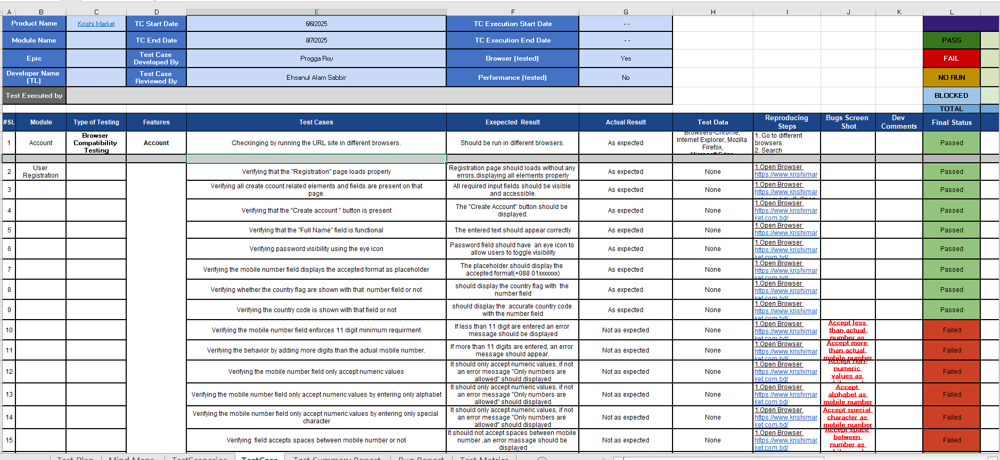
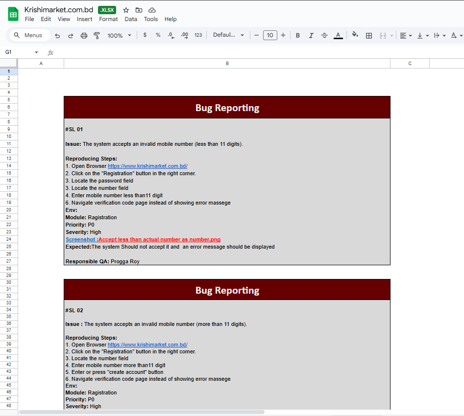
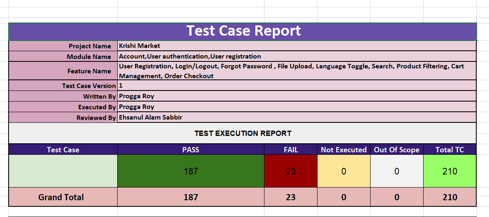

# 🧪 KrishiMarket.com.bd – Manual Testing Project

A **manual testing project** on the e-commerce website **[KrishiMarket.com.bd](https://www.krishimarket.com.bd/)** — focused on product filtering, cart, checkout, UI behavior, and user experience validation.

---

## 📌 Project Overview

KrishiMarket is a digital platform for selling agricultural tools, seeds, and books. This project aims to test the **functional stability**, **user experience**, and **responsiveness** across various modules through **manual testing techniques**.

---

## 🎯 Testing Objectives

- Validate core **functionalities** (category filters, cart, checkout, login)
- Detect **UI/UX issues** or bugs
- Perform **cross-browser testing**
- Ensure data consistency and error handling
- Verify links (social media, footer)
- Conduct **boundary**, **negative**, and **edge-case** testing

---

## 📘 Testing Scope

| Type of Testing       | Covered? |
|-----------------------|----------|
| ✅ Functionality Testing  | Yes |
| ✅ UI/UX Testing           | Yes |
| ✅ Input Validation        | Yes |
| ✅ Checkout Flow           | Yes |
| ✅ Cross-Browser Testing   | Yes |
| ✅ Security Testing (Basic) | Partial |

## 📝 Test Artifacts

### 🧾 Test Cases  
Detailed test cases for:
- Category-based filtering  
- Product sorting  
- Cart functionality  
- Checkout and payment flow  
- Broken links  
- Input validations  
- UI issues

### 🧩 Bug Reports  
All failed test cases documented with:
- Steps to reproduce  
- Screenshot  
- Severity & Priority  
- Status

 

---

## 🧪 Test Summary

- **Total Test Cases:** 210  
- ✅ **Passed:** 187  
- ❌ **Failed:** 23  
- 📊 **Test Coverage:** 100% of major features
  
 

---

## 🧠 Mind Map

Visual representation of:
- Test modules
- Feature coverage
- Scenario branching

📌 Tool Used: **XMind**

---

## 📊 Test Metrics & Reporting

| Metric                     | Value         |
|----------------------------|---------------|
| Total Test Cases           | 210           |
| Passed                     | 187           |
| Failed                     | 23            |
| Bug Fix Rate               | 65%           |
| Feature Coverage           | 100%          |

> 📈 _See: ` `_

---

## 🧰 Tools Used

| Tool            | Purpose               |
|------------------|------------------------|
| Excel / Google Sheets | Test case & bug tracking |
| XMind             | Mind mapping strategy |
| Chrome, Firefox   | Cross-browser testing |

---

## 📌 Key Outcomes

- Discovered **critical bugs** in the filter and checkout flow
- Achieved **complete UI coverage**
- Ensured **social media links** redirect correctly
- Suggested UI improvements (e.g., spelling corrections, button behavior)
- Prepared structured **documentation** for QA reports

---

## 📚 Conclusion

This manual testing project ensured that **KrishiMarket.com.bd** delivers a reliable, user-friendly, and functional experience for its users. From test planning to execution, this project demonstrates the depth of analysis and testing in real-world web applications.

---
